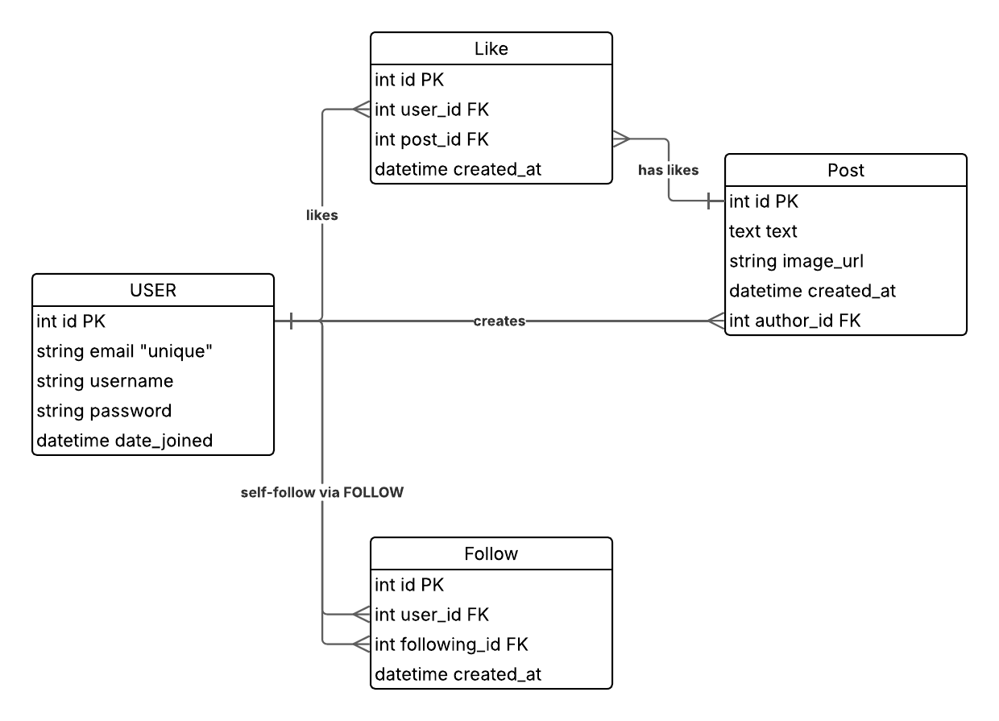
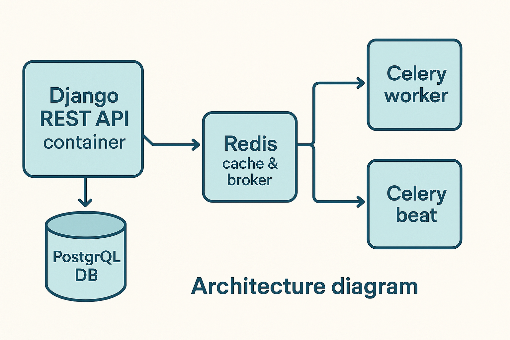

# MiniTwitter

A simple Twitter-like social network with a Django/DRF backend.

## Diagrams
### ER Diagram


### Architecture Diagram


## Table of Contents

* [Features](#features)
* [Tech Stack](#tech-stack)
* [Prerequisites](#prerequisites)
* [Repository Layout](#repository-layout)
* [Backend Setup](#backend-setup)

  * [Environment Variables](#environment-variables)
  * [Docker Compose](#docker-compose)
  * [Running Locally without Docker](#Running-Locally-(without-Docker))
  * [Database Migrations](#database-migrations)
  * [API Documentation (Swagger)](#api-documentation-swagger)
  * [Running Tests & Coverage](#running-tests--coverage)
* [Asynchronous Tasks (Celery)](#asynchronous-tasks-celery)
* [Security & CORS](#security--cors)
* [Continuous Integration](#continuous-integration)

## Features

* **User Authentication**: JWT-based registration, login, refresh tokens
* **Posts**: Create, read, update, delete, with text, images, hashtags, search, pagination
* **Follows**: Follow/unfollow users, list followers & following
* **Likes**: Like/unlike posts, list likes
* **Feed**: Cached Redis-backed feed of followed users
* **API Docs**: Auto-generated OpenAPI schema with Swagger UI & Redoc
* **Tests**: Unit & integration tests covering edge cases, 98%+ coverage
* **Async Tasks**: Celery tasks for follow notifications
* **Security**: Rate limiting, secure headers, CORS configuration
* **Docker & CI**: Containerization with Docker Compose, GitHub Actions CI pipeline

## Tech Stack

* **Backend**: Python, Django, Django REST Framework, PostgreSQL, Redis, Celery
* **DevOps**: Docker Compose, GitHub Actions, coverage.py, drf-spectacular

## Prerequisites

* [Docker & Docker Compose](https://docs.docker.com/compose/)
* Node.js >= 18 & npm
* (Optional) Python 3.11+ for local virtualenv development

## Repository Layout

```
minitwitter/
├── backend/                 # Django backend
│   ├── apps/                # Django apps (users, posts, follows, likes)
│   ├── config/              # project settings, URLs, Celery
│   ├── Dockerfile
│   ├── docker-compose.yml
│   ├── manage.py
│   ├── requirements.txt
```

---

## Backend Setup

### Environment Variables

Create a `.env` file in `backend/` (will be loaded by `django-environ` if configured):

```
SECRET_KEY=your_django_secret_key
POSTGRES_DB=minitwitter
POSTGRES_USER=minitwitter_user
POSTGRES_PASSWORD=minitwitter_password
POSTGRES_HOST=db
POSTGRES_PORT=5432
REDIS_HOST=redis
```

### Docker Compose

From the `backend/` directory, bring up the containers:

```bash
docker-compose up -d --build
```

Services:

* **db**: PostgreSQL
* **redis**: Redis (cache & Celery broker)
* **web**: Django application
* **worker**: Celery worker
* **beat**: Celery beat scheduler (optional)

### Running Locally (without Docker)

1. Create & activate a virtual environment:

   ```bash
   python -m venv venv
   source venv/bin/activate
   ```
2. Install dependencies:

   ```bash
   pip install -r requirements.txt
   ```
3. Configure `settings.py` to use `HOST=localhost` for DB & Redis.
4. Start Django server:

   ```bash
   python manage.py migrate
   python manage.py runserver
   ```

### Database Migrations

Apply migrations:

```bash
docker-compose exec web python manage.py makemigrations
docker-compose exec web python manage.py migrate
```

### API Documentation (Swagger)

* **OpenAPI JSON**: `GET http://localhost:8000/api/schema/`
* **Swagger UI**: `http://localhost:8000/api/schema/swagger-ui/`
* **Redoc**: `http://localhost:8000/api/schema/redoc/`

### Running Tests & Coverage

Inside the `backend/` folder:

```bash
docker-compose exec web coverage run --parallel-mode manage.py test
docker-compose exec web coverage combine
docker-compose exec web coverage report  # console summary
docker-compose exec web coverage html    # HTML report in coverage_html_report/
```

## Asynchronous Tasks (Celery)

* Celery broker & backend use Redis at `redis://{REDIS_HOST}:6379/0`.
* Start worker & beat via Docker Compose:

  ```bash
  docker-compose up -d worker beat
  ```

- Task: `send_follow_notification.delay(follower_id, followed_id)`

---

## Security & CORS
- **Rate Limiting**: DRF UserRateThrottle & AnonRateThrottle
- **Secure Headers**: HSTS, SSL redirect, secure cookies, X-Content-Type-Options
- **CORS**: configured via `django-cors-headers`:
  ```python
  CORS_ALLOWED_ORIGINS = ['http://localhost:3000']
  CORS_ALLOW_CREDENTIALS = True

---

## Continuous Integration

GitHub Actions workflow in `.github/workflows/ci.yml`:

* Starts Postgres & Redis services
* Runs migrations & tests with coverage
* Uploads coverage HTML report artifact
